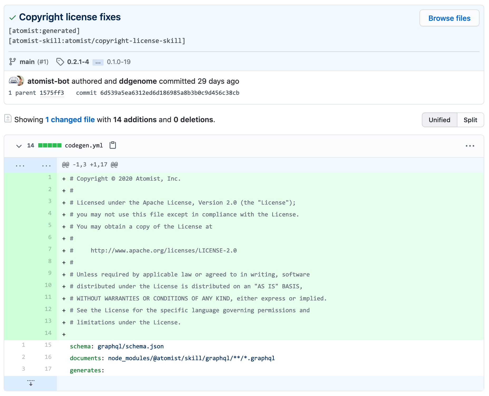
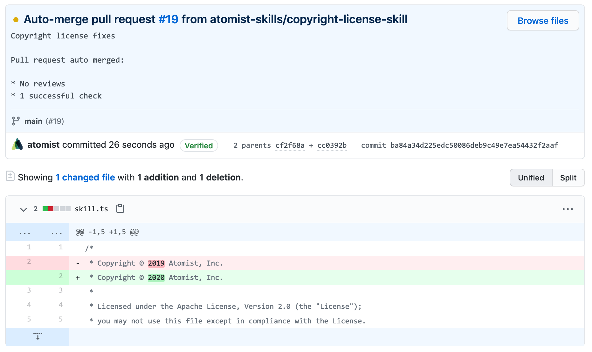
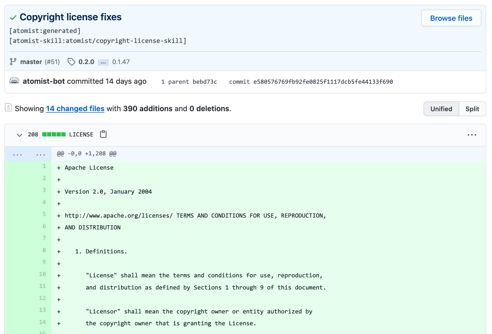

Open source licenses recommend you include copy of the license and a
copyright/license header in each source code file in a repository. This skill
ensures your repositories contain the proper license file and each source code
file contains the proper license header with up-to-date copyright.

-   Ensure your repositories have the proper license file
-   Add and update the copyright header in source code files
-   Automatic license detection
-   Add copyright header to all files or only files that have changed
-   Customize the types of files managed by this skill
-   Create pull requests or commit updates directly to branch

On each push to a configured repository, this skill ensures the repository has
the proper license file and that all files have the proper license header with
an up-to-date copyright notice. The "proper" license can be provided in the
skill configuration or automatically determined by the contents of the `LICENSE`
file in the repository. If a file does not have a copyright license header, one
is added. If a file has a copyright header, its copyright license header is
updated if the file was changed and the copyright year is not the current year.

### Add copyright/license header to files

### Update copyright year in changed files

### Add license file

