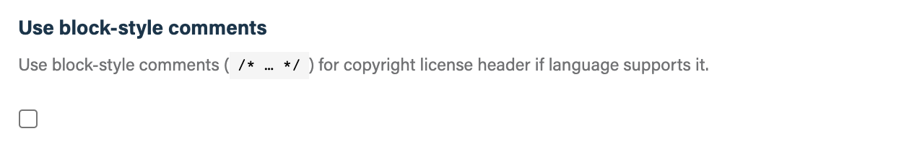

## Before you get started

Connect and configure the required [**GitHub**][github] integration.

[github]: https://go.atomist.com/catalog/integration/github "GitHub Integration"

## How to configure

1.  **License**

    

    Select one of the [SPDX open source licenses][spdx] from the list. If you do
    not select a license, the skill will look for license file in the repository
    and attempts to determine what license it is. To find the file, it does a
    case-insensitive match in the root of the repository for files matching
    `license` or `license.*`.

2.  **Copyright holder**

    

    Enter the copyright holder of the files in the repository. This is typically
    your name or your company name, e.g., `Atomist, Inc.`.

3.  **Matching glob pattern**

    

    If you want to override the default [glob pattern][glob] used to match files
    to scan for copyright/license headers, you can provide it here. Don't forget
    to begin your glob pattern with `**/` to ensure the skill looks in all
    subdirectories of your repositories.

4.  **Ignore glob patterns**

    

    If there are specific files you want to exclude from management by this
    skill, you can enter file names and/or glob patterns here.

5.  **Consider only changed files**

    

    If you want to make sure all source code files in the repository have
    copyright/license headers, uncheck this option. If you only want to add
    license headers to files that are modified by other commits, leave this
    option selected.

6.  **Use block-style comments**

    

    If you want the copyright/license headers to use C-style block comments,
    i.e., `/* … */`, in file types that support that commenting style, select
    this option.

7.  **Commit Strategy**

    

    Choose how to apply copyright and license updates to the repository. The
    following options are available:

    -   **Raise pull request for default branch; commit to other branches** -
        with this option, fixes on the default branch will be submitted via a
        pull request; fixes on other branches will be committed straight onto
        the branch
    -   **Raise pull request for default branch only** - with this option, fixes
        on the default branch will be submitted via a pull request; fixes on
        other branches will not be persisted
    -   **Raise pull request for any branch** - with this option, fixes on all
        branches will be submitted via a pull request
    -   **Commit to default branch only** - with this option, fixes on the
        default branch will be committed straight to the branch; fixes on other
        branches will not be persisted
    -   **Commit to any branch** - with this option, fixes on all branches will
        be committed straight to the branch

    Pull requests that get raised by this skill will automatically have a
    reviewer assigned based on the person who pushed code. Pull requests that
    are not needed any longer, i.e., because all lint violations were fixed
    manually, are closed automatically.

8.  **Pull request labels**

    

    Add additional labels to pull requests raised by this skill.

    This is useful to influence how and when the PR should be auto-merged by the
    [Auto-Merge Pull Requests][auto-merge] skill.

9.  **Which repositories**

    

    By default, this skill will be enabled for all repositories in all
    organizations you have connected.

    To restrict the organizations or specific repositories on which the skill
    will run, you can explicitly choose organizations and repositories.

10. **Activate the skill**

    Save your configuration and activate the skill by clicking the "Enable
    skill" button.

[spdx]: https://spdx.org/licenses/ "SPDX License List"
[glob]: https://github.com/mrmlnc/fast-glob#pattern-syntax "Glob pattern syntax"
[auto-merge]:
    https://go.atomist.com/catalog/skills/atomist/github-auto-merge-skill
    "Atomist Auto-Merge Pull Request Skill"
